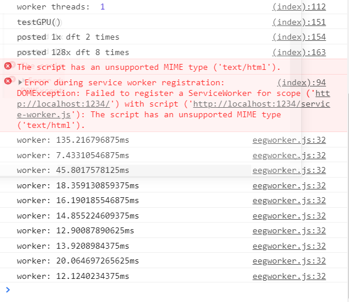
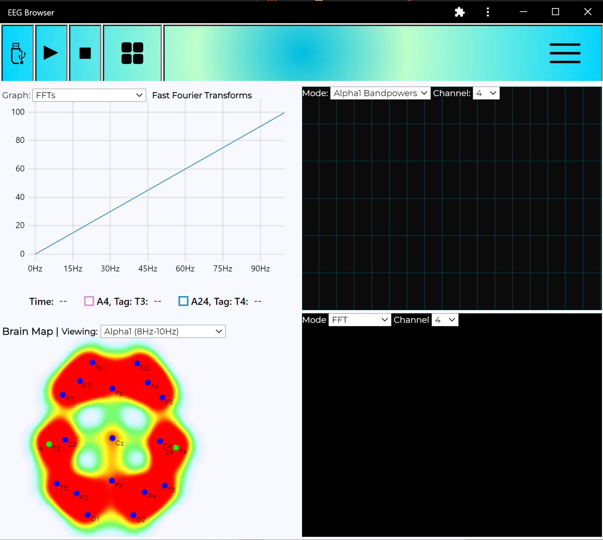
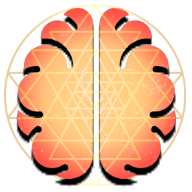

# Test for EEG browser PWA

Not fully working yet in this node implementation but you can at least test the EEG worker. [old repo](https://github.com/moothyknight/free_eeg32_web)

with node installed, cd to where you extracted this folder from your command prompt then use the command

`npm install`

then

`npm start`

## Cool features

* GPU js FFTs with web workers enabling real time DSP for as many channel inputs as you want. Benchmarked 128 channels * 512 samples in 8.3ms, about 15ms-20ms average on an RTX 2060.
* Live charting, coherence, more to come - the UI is not done
* Modular data and visual tools with class based modules, and a modifiable decoder for enabling any hardware.
* Configured for the [FreeEEG32](https://github.com/neuroidss/freeeeg32_beta)

## Javascript EEG Utilities (WIP docs as we add features)

This is still being organized and added to but the core functions are there to start doing some fun stuff with the EEG

testeeg.html

* graphing and ux testing. e.g. brain heat map with channel assignment and streaming multi channel data with different settings
* this is gonna turn into a nice UI module for working with the EEG

There are two main classes you should know about:

#### eeg32 in src/js/eeg32.js

* Contains all necessary functions to connect to, parse, and organize the FreeEEG32 data.
* Decoders can be written for any hardware with serial output and used seamlessly with the rest of the API.
* Increasing number of simple but essential signal analysis functions:

eeg32 class instance functions:

`var eegclass = new eeg32();`

* `eegclass.setupSerialAsync()` - asks for your serial port.
* `eegclass.makeAtlas10_20()` - makes an MNI atlas with tags for standard 10_20 electrode placements. It contains a data substructure for organizing channel FFT data.
* `eegclass.newAtlas(tags,coords)` - make a new MNI atlas with the tags and 3D coords via an array of Array(3)'s. 

There are a couple handlers you can customize in the serial streaming to handle updates on the front end.
* `eegclass.onDecoded = () => {console.log("decoded!");}`
* `eegclass.onConnectedCallback = () => {console.log("port connected!");}`

Static functions in eegmath class:
* `eegmath.genSineWave(frequency, amplitude, seconds, sampleRate, frequency2 (optional), amplitude2 (optional));` - generates a sine wave of the given frequencies, with array length equal to sampleRate * seconds. Frequency 2 is optional e.g. for simulating simple noise.
* `eegmath.cov2d(mat)` - 2D matrix covariance, pretty fast!
* `eegmath.crosscorrelation(arr1,arr2)` - returns the cross-correlogram for the two input signals
* `eegmath.autocorrelation(arr1)` - returns the auto-correlogram for the input signal
* `eegmath.sma(array, window)` - returns an array of the simple moving average based on the window sample size
* `eegmath.mean(array)` - reduces an array to the mean (expected value)
* `eegmath.variance(array)` - returns the variance array of the input array
* `eegmath.transpose(mat)` - 2D matrix transposing for quick maths
* `eegmath.matmul(mat1,mat2)` - 2D matrix multiplication

#### gpuUtils in src/js/utils/gpuUtils.js

* gpu.js based utilities. It's easy enough for my brain to handle
* This does the bulk of the computation work and eats FFTs for breakfast. Accomplished 128 channels * 2048 samples (4 seconds) in 50ms, averages about 70ms runtime in single thread, 20ms in worker threads on RTX 2060 but even works on super old laptops
* I'll try to port the autocorrelation and cross correlation functions in to do mass numbers of them in parallel (e.g. for mapping coherence networks)

`var gpu = new gpuUtils()`

* `gpu.gpuDFT(signalBuffer, nSeconds, texOut = false)` - Single channel DFT, give it a 1D array with the number of seconds of data captured and it will return a 2D array, the first index is a list of the frequency distribution (x-axis) of each amplitude, the second index is the array of amplitudes up to a max of the sample rate / 2 (the nyquist frequency of the sampling rate). 

* `gpu.MultiChannelDFT(signalBuffer, nSeconds, texOut = false)` - Multi channel DFT, input a 2D array with rows of equal widths and the number of seconds sampled. Outputs a 2D array with the frequency distribution (x-axis) in the first index and then the list of amplitudes in the second index.

* `gpu.MultiChannelDFT_Bandpass(signalBuffer, nSeconds, freqStart, freqEnd, texOut = false)` - Multi channel DFT with a bandpass filter applied. Input 2D array with rows of equal widths, number of seconds, high pass frequency (lower bound), and low pass frequency (upper bound). Just set the filter to maximum nyquist sampling frequency for no low-pass filtering. Outputs a 2D array with the band pass window frequency distribution in the first index and the list of -positive- amplitudes in the next index.

* More being tested like inverse DFTs or automatic bandpass then inverse dfts via pipelining, or other combinations. gpujs lets you pass textures of the outputs between kernels with ease which lowers the difficulty for real time DSP. There are also tests in the /other folder e.g. for video convolution or the 128 channel FFT benchmark

#### Benchmark on RTX 2060 using eegworker.js:

##### 128 channels, 512sps, 1 second of data with bandpass filter: 8.3ms fastest, 20ms average.

##### 1 channel, 512sps, 1 second of data: 1.9ms fastest, 3.5ms average

### Visual features

Also in eegvisuals.js, for now you will find many visual classes and some other utilities like sound buffering and geolocation. See the file to know how to make proper calls and be sure to include the right modules. This includes helpers to make smoothiejs charts, stacked or overlaid uplot charts, brainmaps, and soon colored bar bandpower charts and a theta-gamma 2 octave module for Dmitry.

The idea is to make it so the lightweight analysis and visual tools are both there as needed, I'm still fleshing this concept out but think of a cross between a python scientific package and a web game engine library. My HEG software is essentially this and I want to expand both to then be combined for a WebBCI framework. This will make use of all the best of the web.
 
* `var smoothie = new SmoothieChartMaker()` - make a [Smoothiejs](http://smoothiecharts.org/) instance for smooth time series visualization
* `var uplotter = new uPlotMaker()` - make a [uPlot](https://github.com/leeoniya/uPlot) instance, allows for overlaid or stacked (vertical) time series or FFT (or whatever really) visualization.
* `var brainmap = new brainMap2D()` - make a brain heat map using the atlas from your eeg32 instance, tags each point with their atlas name (e.g. Fp1, Cz) and which ADC channels are assigned. Uses [webgl-heatmap](https://github.com/pyalot/webgl-heatmap) for visualization 

Incoming:
* colored bar charts - a common eeg visual you see to highlight band powers
* theta-gamma 2 octave - Dmitry's test to show working memory coherence patterns with audio and heatmap visualization using my soundjs toy and uplot
* alpha coherence visualization - for alpha training e.g. with meditation

On the right you can see single threaded performance statistics (<20ms average for 128x FFTs on worker threads)

